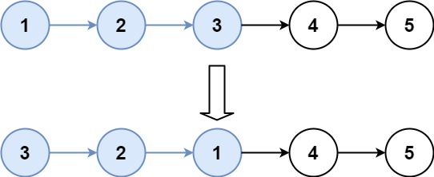

### 25. K 个一组翻转链表

#### 说明

给你一个链表，每 k 个节点一组进行翻转，请你返回翻转后的链表。

 k   是一个正整数，它的值小于或等于链表的长度。

如果节点总数不是 k 的整数倍，那么请将最后剩余的节点保持原有顺序。

`示例1


```text
输入：head = [1,2,3,4,5], k = 2
输出：[2,1,4,3,5]
```


`示例2`


```text
输入：head = [1,2,3,4,5], k = 3
输出：[3,2,1,4,5]
```
`示例3
```text
输入：head = [1,2,3,4,5], k = 1
输出：[1,2,3,4,5]
```

`示例4`

```text
输入：head = [1], k = 1
输出：[1]
```